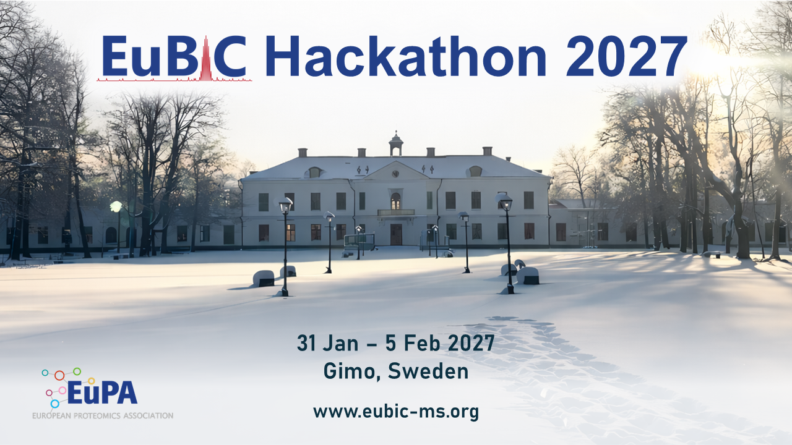

# EuBIC-MS Hackathon 2027

**31 January - 5 February 2027; Gimo, Sweden**

This repository is the home for all discussions and proposals regarding the EuBIC-MS Hackathon 2027.

💡 Go to [Discussions](https://github.com/EuBIC/EuBIC2027/discussions) to see all hackathon proposals or propose your own idea

🧑‍💻 [Become a EuBIC-MS member](https://eubic-ms.org/become-a-member/) to join the organizational team on Slack

For more information about the meeting, please check the [official website](https://eubic-ms.org/events/hackathon-2027/).

## Hackathon projects

### How to submit

Please carefully read the [full guidelines](https://github.com/eubic/EuBIC2027/blob/master/FullGuidelines.md) before submitting a project proposal and make sure to add all relevant information to your proposal. Examples from the 2025 edition can be found [here](https://github.com/EuBIC/EuBIC2025/discussions/categories/hackathon-proposals).

Create a [discussion](https://github.com/EuBIC/EuBIC2027/discussions/new?category=hackathon-proposals) in this repository describing your project. The link takes you to a form listing some of the relevant information that should be included.

### How to vote

- Upvote for your favorite project(s) in the [Discussions](https://github.com/EuBIC/EuBIC2027/discussions/categories/hackathon-proposals) section!
- Leave comments to interesting proposals. Engage in a discussion to fine-tune the project proposals!

Your votes do not determine which hackathon project you will join at the conference. On the first day of the event, you may choose any project, irrespective of how you voted.

### Important dates and deadlines

- Hackathon proposal deadline: ~~30 June~~ 1 September 2026
- Registration open: 1 September 2026
- Hackathons selected: 14 September 2026
- Abstract deadline: 11 December 2026
- Registration deadline: 11 December 2026

---

This repository, including project proposals and discussions, are subject to the [EuBIC-MS Code of Conduct](https://eubic-ms.org/about/code-of-conduct/).
